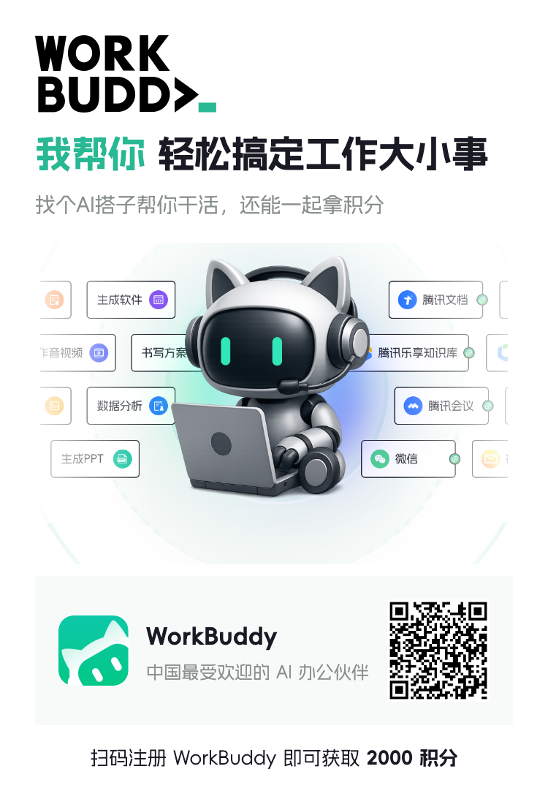

# 工作台完整使用指南

这份文档面向第一次使用工作台的人，也适合用来录制公开演示。建议按照“准备数据 → 建立分类 → 管理任务 → 管理内容 → 复盘 → 同步”的顺序操作。

## 使用前先知道：先改造成你的工作台

工作台不是一套适用于所有人的固定成品，而是一个可以交给 WorkBuddy 改造的基础骨架。仓库提供通用的页面、接口、空数据结构和连接方式；你的职业、业务对象、字段、流程、权限和自动化，需要根据实际工作重新定义。

例如：

| 使用者 | 可能需要重点管理的内容 |
|---|---|
| 内容运营 | 作品、选题、评论、素材、发布复盘 |
| 项目运营 | 项目、任务、负责人、交付物、风险 |
| 销售或客户成功 | 客户、商机、跟进记录、合同和回款 |
| 研究或咨询人员 | 来源资料、分析结论、引用、交付版本 |

第一次打开看到空页面不是缺少内容，而是等待你先定义工作边界。推荐顺序是：

1. 先说清楚你的岗位、服务对象、日常工作和固定产出；
2. 让 WorkBuddy 读取代码和空数据结构，只输出改造建议；
3. 你确认页面、字段、状态和数据归属后，再执行修改；
4. 导入真实资料，最后再配置飞书或其他自动化。

不要让 AI 一开始就凭空生成演示记录，也不要在没有备份和字段映射的情况下覆盖原数据。

## WorkBuddy 邀请与积分说明

WorkBuddy 是腾讯的 AI 办公软件，部分能力需要消耗积分。按当前活动说明，扫描海报二维码注册/下载可额外获得 **2000 积分**；现在下载后每天可领取 **100 积分**，活动截止 **8 月 5 日**。积分规则、领取方式和有效期以活动页面实际显示为准。



也可以直接打开[WorkBuddy 邀请链接](https://www.codebuddy.cn/events/invite?inviteCode=t01jaexsv7t8czda)。

## 一、先理解数据边界

工作台是浏览、整理和执行入口，不应该成为所有数据的唯一来源。

| 数据 | 建议主系统 | 工作台做什么 |
|---|---|---|
| 团队任务、日程、正式客户记录 | 飞书或其他协作平台 | 聚合、草稿、确认后同步 |
| 个人理解、复盘和方法论 | Obsidian 或其他知识库 | 读取、生成复盘、转任务 |
| 内容作品、选题、评论分析 | 私有数据目录 | 浏览、筛选、归类和复盘 |
| API 凭证、浏览器登录状态 | 本机环境变量或系统密钥管理 | 不进入仓库、不进入前端 |

公开仓库的 `data/` 是空结构，不要直接向公开仓库写真实资料。

## 二、第一次使用流程

### 1. 启动

```bash
cp .env.example .env
npm start
```

打开 `http://127.0.0.1:8787`。先确认页面可以加载，再开始导入资料。

### 2. 用 CodeBuddy 建立自己的字段

进入 [WorkBuddy 下载/进入页](https://www.codebuddy.cn/events/invite?inviteCode=t01jaexsv7t8czda)，打开仓库后，可以先发送：

> 请检查当前工作台所有页面、接口和 data/ 空 JSON 文件，输出字段关系图。不要填入示例记录，不要修改数据。只告诉我从我的 CSV/JSON 导入时需要哪些字段。

确认字段后，再让它做转换：

> 请把这份 CSV 转成工作台要求的 JSON。先输出字段映射和隐私风险，不要写入文件；我确认后再保存。

### 3. WorkBuddy 完整操作教程

下文把能够读取和修改仓库的 AI 工具统称为 WorkBuddy；可以通过 [WorkBuddy 下载/进入页](https://www.codebuddy.cn/events/invite?inviteCode=t01jaexsv7t8czda) 使用。WorkBuddy 的作用不是替你猜业务，而是根据你的说明改造基础骨架、整理数据和执行检查。

#### 第一步：先让它认识项目

第一次不要直接说“帮我做好工作台”，先让它只阅读并盘点：

> 请先阅读 README.md、docs/完整使用指南.md、package.json、public/、server.mjs 和 data/。当前目标是把这个基础工作台改造成适合【我的职业/岗位】的个人工作系统。请只输出：现有页面、数据文件、接口、可保留模块、需要删除模块、需要新增字段、需要调整的流程，以及你需要向我确认的问题。不要修改文件，不要创建模拟数据。

#### 第二步：补充你的工作上下文

按下面的顺序告诉它，不需要一次写得很长：

1. 你的职业、服务对象和工作目标；
2. 每周重复出现的工作和固定交付物；
3. 要管理的对象，例如任务、客户、项目、作品、合同或资料；
4. 目前使用的工具，例如 Excel、飞书、Obsidian、邮箱或其他平台；
5. 哪些数据可以公开，哪些必须留在本地；
6. 希望自动化的动作，以及哪些动作必须人工确认。

#### 第三步：先看改造清单，再批准执行

让 WorkBuddy 输出一张改造清单，至少包含：

| 项目 | 要回答的问题 |
|---|---|
| 页面 | 哪些页面保留、改名、合并或删除？ |
| 数据 | 每张表管理什么，字段和示例值是什么？ |
| 流程 | 数据从哪里来，经过什么状态，最终产出什么？ |
| 权限 | 哪些内容只能本人查看或修改？ |
| 自动化 | 哪些动作可以自动执行，哪些必须先确认？ |
| 验收 | 修改后用什么页面、接口和命令验证？ |

确认后再发送：

> 按刚才确认的第【编号】项执行。只修改【文件/模块】，不要改动其他页面和数据。完成后列出修改文件、字段变化、接口变化和验证结果。

#### 第四步：分别处理界面、数据和流程

不要把“改页面”和“导入数据”混在一个请求里。可以分别使用：

> 修改【页面名称】的【界面区域】：将【现状】调整为【目标状态】。保留现有数据结构，先说明会改哪些 HTML/CSS/JavaScript 文件，确认后再执行。

> 将这份【CSV/JSON/表格】导入【数据模块】。先输出字段映射、缺失字段、重复记录和隐私风险，不要写入；我确认映射后再保存。

> 将【工作流程】拆成状态、负责人、下一步动作和验收证据，并说明应该落在哪个页面、哪个 JSON 文件或飞书表格中。

#### 第五步：让它验证，而不是只说“完成了”

每次改动后都要求：

> 请运行 `npm run check`，检查 JSON 是否有效；启动本地服务，验证首页、相关接口和关键交互。最后告诉我通过了什么、还没有验证什么，以及修改是否需要人工复核。

涉及删除、飞书写入、外部平台采集、真实客户资料或公开发布时，必须要求 WorkBuddy 先停下来说明影响并等待确认。

#### 第六步：保留变更记录

使用 Git 的项目，验收前让它执行：

> 请先查看 `git status` 和 `git diff`，按文件说明本次变化，不要自动提交或推送；等我确认后再提交。

这样可以知道 WorkBuddy 改了什么，也能在另一台电脑上通过 `git pull` 同步。真实数据建议放在 `.env` 指向的私有目录，不要随代码提交。

### 4. 工作台界面术语

和 WorkBuddy 沟通时，尽量使用下面的名称，不要说“左边那块”“下面那个框”。同一个区域使用固定叫法，修改会更准确。

| 推荐叫法 | 英文/代码常用名 | 指什么 | 示例说法 |
|---|---|---|---|
| 工作台 / 应用壳 | App shell | 整个应用的外层结构 | 调整工作台整体间距 |
| 边栏 / 侧边导航 | Sidebar | 页面左侧的导航区域 | 在边栏增加一个“合同管理”入口 |
| 品牌区 | Brand area | 边栏顶部的图标和名称 | 保留品牌区布局，改成通用名称 |
| 导航分组 | Nav section | 边栏里的“项目管理、工具、运营”等分组 | 将“业务数据”放到运营分组 |
| 导航项 | Nav item | 边栏中可以点击的单个页面入口 | 给导航项增加未读数量 |
| 主体 / 主内容区 | Main / workspace | 右侧展示当前页面内容的区域 | 让主体区域在窄屏下单列显示 |
| 顶栏 / 页面头部 | Topbar / page header | 主体顶部的标题和操作区域 | 在顶栏保留页面标题和新增按钮 |
| 页面标题 | Page title | 当前页面的一级标题 | 把页面标题改为“项目计划” |
| 副标题 | Page subtitle | 页面标题旁的补充说明 | 副标题显示当前平台 |
| 顶部操作区 | Top actions | 顶栏右侧的新增、刷新、同步等按钮 | 将“同步”放进顶部操作区 |
| 工具栏 | Toolbar | 搜索、筛选、排序、视图切换的集合 | 重排作品库工具栏 |
| 搜索框 | Search field | 根据关键词查找记录的输入框 | 在选题池工具栏上方放搜索框 |
| 筛选器 / 筛选栏 | Filter / filter bar | 按状态、分类、平台等缩小记录范围 | 让领域、话题、受众筛选器竖向排列 |
| 筛选组 | Filter group | 筛选栏中的一组标签或按钮 | 为作品库新增“形式”筛选组 |
| 标签 / 筛选标签 | Chip / tag | 可以点击的分类、状态或条件 | 将“高互动”做成筛选标签 |
| 页签 / 标签页 | Tab | 在同一页面内切换不同内容集合 | 将“选题池”和“外部模型”做成页签 |
| 视图切换 | View switcher | 卡片、表格、时间线、榜单等展示方式 | 增加作品库的时间线视图 |
| 指标卡 | Metric card | 展示数量、金额、比例等摘要数据 | 顶部增加本周新增任务指标卡 |
| 面板 / 卡片 | Panel / card | 承载一组相关信息或操作的容器 | 将风险信息放在独立面板 |
| 看板列 | Board column | 看板中按状态分组的一列 | 把“待确认”单独设为看板列 |
| 列表 / 表格 / 时间线 / 榜单 | List / table / timeline / ranking | 记录的具体呈现方式 | 表格列显示负责人和截止日期 |
| 详情面板 / 详情抽屉 | Detail panel / drawer | 点击记录后查看完整内容的区域 | 点击作品卡片后打开详情面板 |
| 弹窗 / 模态框 | Modal / dialog | 新增或编辑记录时覆盖页面的窗口 | 新建任务使用弹窗，不离开当前页 |
| 表单字段 | Form field | 输入框、下拉框、日期、文本域等 | 给任务表单增加验收证据字段 |
| 状态徽标 | Badge | 显示状态、优先级或风险等级的小标签 | P0 使用醒目的状态徽标 |
| 空状态 | Empty state | 当前没有记录时的页面内容 | 空状态只提示下一步，不填虚构数据 |
| 提示消息 | Toast | 保存成功、失败或同步结果的短提示 | 保存后显示成功提示消息 |

描述修改需求时，推荐使用这个句式：

> 在【页面】的【界面区域】中，对【数据或控件】执行【动作】，达到【结果】；保留【不能改变的部分】，用【验收方式】验证。

例如：

> 在“作品库管理”的“筛选栏”中增加“形式”筛选组，选项为图文、视频、直播切片；不改变原有作品字段；用空数据和一条测试记录验证筛选结果。

### 5. 建立分类

进入“爆款选题 Lab”或“后台设置”，为自己的内容建立：

- 领域：内容栏目或业务方向；
- 话题：用户讨论的主题；
- 受众：内容真正要触达的人群；
- 内容模型：标题、结构和承接方式；
- 形式：图文、视频、直播切片等。

分类不是越多越好。第一次建议每类不超过 8 个，发布 10 到 20 条后再合并或拆分。

## 三、任务计划完整流程

1. 点击“新建任务”。
2. 填写任务名称、任务域、归属系统、负责人、优先级和截止日期。
3. 在“下一步动作”中只写当前最小动作，不要写一段模糊目标。
4. 在“阶段验收证据”中写完成后要留下的文件、链接、记录或截图。
5. 打开任务详情，按步骤勾选。所有步骤完成后再把任务改为“已完成”。
6. 复盘完成结果，必要时点击“转任务”生成下一项工作。
7. 配置飞书后，点击“同步到飞书”；同步前先确认目标表字段。

任务设计原则：每个任务只对应一个交付结果；跨部门事项要在协作人和证据字段中留下明确记录。

## 四、增长日报完整流程

1. 先录入日期和平台。
2. 填写粉丝、日增、互动、线索等结果指标。
3. 在备注中记录数据来源和异常原因。
4. 复制日报，形成“结果 → 判断 → 明日动作”的固定格式。
5. 每周把日报中的重复问题转成任务或经验复盘。

不要只记录粉丝数。内容运营至少同时看互动、评论、私信、线索、报名和复购等与目标有关的指标。

## 五、选题 Lab 完整流程

### 选题池

每条选题至少填写：标题、领域、目标受众、用户痛点、情绪抓手、素材需求、内容结构、转化目标、授权状态和下一步动作。

判断顺序：

1. 这个题是否对应真实用户问题；
2. 是否能在前几秒或前几行建立具体场景；
3. 是否有可验证素材；
4. 是否有清晰承接动作；
5. 是否值得复写、承接、投放或沉淀。

### 外部内容模型

模型不是爆款保证，也不是复制模板。它只用于提取标题结构、情绪节奏、内容顺序和承接方式。使用外部案例时要记录来源、发布日期、平台、适用人群和不可照搬的部分。

### 本账号高互动

这里不等于公域爆款。它只代表同一个账号历史内容中相对有效的样本。应该和外部爆款模型分开比较：外部看打法，本号看验证。

### 分类管理

先增加分类，再把内容放入分类。分类变动会影响筛选和看板，因此建议每周或每两周统一维护，不要每天随意改名。

## 六、作品库完整流程

作品库一条记录建议聚合：

- 平台、作品链接、发布时间和内容形式；
- 标题、正文、话题和素材类型；
- 点赞、收藏、评论、分享、播放等公开指标；
- 评论原文、评论类型和用户需求；
- 高互动、低互动、无评论、零互动等反向标签；
- 情绪抓手、转化承接、授权状态和下一步选题。

分析时按这个顺序：

1. 总体互动和分类贡献；
2. 高互动作品的标题、开头、形式和评论需求；
3. 低互动或无评论作品的反面原因；
4. 评论中反复出现的问题；
5. 能复写、能承接、能投放、只能沉淀的内容；
6. 形成下一批选题和素材清单。

如果来源是 CSV 或 JSON，先放到私有数据目录，再通过 CodeBuddy 检查字段，不要把原始导出文件直接提交到公开仓库。

## 七、客户跟进完整流程

1. 选择客户类型、来源平台和跟进阶段。
2. 输入客户原话或具体问题。
3. 生成沟通草稿。
4. 人工检查事实、价格、承诺和语气。
5. 保存为本地草稿。
6. 确认需要进入正式客户库后，再手动或通过飞书流程写入。

AI 只能帮助整理表达，不能代替对客户身份、价格、合同、服务边界和隐私的判断。

## 八、会议纪要、日程和指标

会议纪要至少记录：日期、参会对象、问题、结论、异议、后续动作和负责人。

日程至少记录：标题、日期、时间、地点或会议链接、类型、负责人、状态和备注。真正需要提醒的节点应进入团队日历，而不是只留在本地 JSON。

指标至少记录：名称、分类、数值、单位、统计周期、数据日期、来源和计算方式。没有来源和口径的数字不能直接用于对外材料。

## 九、飞书 OpenAPI 配置

### 1. 注册企业自建应用

1. 打开飞书开放平台：<https://open.feishu.cn/app>。
2. 使用有权限的飞书账号登录。
3. 创建“企业自建应用”，填写应用名称和说明。
4. 在应用凭证页复制 `App ID` 和 `App Secret`。`App Secret` 只保存到本机环境变量，不能发到群里、截图或提交 Git。

### 2. 配置权限

在应用的“权限管理”中按实际需要申请：

| 需要 | 权限方向 |
|---|---|
| 同步任务到多维表 | 多维表格应用、数据表和记录的查看/编辑权限 |
| 读取知识库目录 | 知识库节点的查看权限 |
| 读取日历或创建日程 | 日历和日程的查看/创建权限 |
| 读取用户信息 | 仅在确实需要识别协作者时申请，不要默认申请通讯录全量权限 |

权限名称可能随飞书版本变化，以开放平台页面显示的资源和操作为准。公开版当前只实现任务写入多维表；其他能力需要单独开发和授权。

### 3. 获取多维表参数

打开目标多维表格，复制链接。常见链接形态为：

```text
https://example.feishu.cn/base/APP_TOKEN?table=TBL_ID&view=VIEW_ID
```

- `APP_TOKEN` 是多维表格应用 Token，也常被称为 Base Token；
- `TBL_ID` 是数据表 ID；
- `VIEW_ID` 是视图 ID，当前任务写入不需要它。

不要把完整链接写进公开源码。只把这两个值放到 `.env`。

### 4. 准备任务表字段

公开版同步任务使用以下字段名。第一次建议把日期和步骤字段设为文本字段，确认写入成功后再按企业规范改成日期、人员或单选字段，并同步调整映射。

| 字段 | 建议类型 | 用途 |
|---|---|---|
| 任务编号 | 文本 | 工作台唯一编号 |
| 任务名称 | 文本 | 任务标题 |
| 负责人 | 文本或人员 | 当前负责人 |
| 协作人 | 文本 | 协作对象 |
| 优先级 | 单选或文本 | P0/P1/P2 等 |
| 当前状态 | 单选或文本 | 待开始、进行中、已完成等 |
| 截止日期 | 文本或日期 | 任务截止时间 |
| 下一步动作 | 文本 | 当前最小动作 |
| 阶段验收证据 | 文本 | 完成证据 |
| 任务类型 | 文本或单选 | 任务所属领域 |
| 任务步骤 | 多行文本 | 带勾选符号的步骤清单 |

字段名称必须和表格中的名称一致。推荐先新建一个测试表，不要直接连接正式业务表。

### 5. 配置环境变量

在项目根目录复制 `.env.example` 为 `.env`，填入：

```bash
WORKBENCH_ENABLE_FEISHU=true
FEISHU_APP_ID=cli_xxxxxxxxx
FEISHU_APP_SECRET=xxxxxxxxxxxxxxxx
FEISHU_BASE_TOKEN=xxxxxxxxxxxxxxxx
FEISHU_TABLE_ID=tblxxxxxxxxxxxxxxxx
FEISHU_API_BASE_URL=https://open.feishu.cn
```

当前服务端通过官方接口完成两步：先用 `App ID + App Secret` 获取租户访问令牌，再用该令牌向指定多维表新增或更新记录。凭证不会发送到浏览器页面。

### 6. 测试同步

```bash
npm run check
npm start
```

在工作台中新建一条不含敏感信息的测试任务，点击“同步到飞书”。成功后检查：

1. 飞书测试表是否出现记录；
2. 再次点击是否更新同一条记录；
3. 负责人、状态、步骤和截止日期是否符合预期；
4. 删除测试记录后，是否仍保留本地任务；
5. 关闭 `WORKBENCH_ENABLE_FEISHU` 后，页面是否明确提示未启用。

### 7. 常见问题

| 现象 | 排查 |
|---|---|
| 提示飞书同步未启用 | 检查 `WORKBENCH_ENABLE_FEISHU`、App ID、App Secret、Base Token、Table ID 是否都存在，重启服务 |
| 获取访问令牌失败 | 检查 App Secret、应用状态、租户和网络；不要把 Secret 贴到日志中 |
| 无权访问多维表 | 在应用权限中增加多维表查看/编辑权限，并确认应用已发布或已添加到租户 |
| 字段写入失败 | 核对字段名称和类型，先使用文本字段验证，再逐项改成日期、单选或人员字段 |
| 更新变成新增 | 检查 `data/feishu-task-map.json` 是否可写，确认任务编号没有被手动改写 |
| 公开部署不能写飞书 | 不要把 Secret 放到前端或静态托管；必须通过受保护的服务端环境变量运行 |

## 十、哪些功能可以自动化

| 功能 | 默认状态 | 建议自动化方式 |
|---|---|---|
| 本地 JSON 读写 | 开启 | 工作台直接读写，适合个人草稿和复盘 |
| 任务步骤状态 | 开启 | 勾选步骤后更新本地任务状态 |
| 选题分类管理 | 开启 | 页面中手动维护，必要时由 CodeBuddy 批量整理 |
| 作品库导入 | 需提供数据 | 先 CSV/JSON 导入，再人工抽查 |
| AI 分析 | 未内置 | 使用 CodeBuddy 或其他模型，先生成建议再人工确认 |
| 飞书任务写入 | 默认关闭 | 配置 OpenAPI 后按按钮写入，保留人工确认 |
| 外部平台采集 | 默认关闭 | 在私有环境中单独开发连接器，遵守平台规则 |
| 删除和批量覆盖 | 不自动执行 | 必须人工确认并先备份 |

凡是涉及外部平台写入、个人信息、合同、财务、客户或公开发布的动作，都不应做成无确认的自动化。

## 十一、公开演示脚本

可以按以下顺序向粉丝介绍：

1. 打开工作台，说明它是本地优先的运营入口，默认没有预置业务数据。
2. 进入后台设置，先建立领域、话题、受众和任务状态。
3. 新建一条任务，填写下一步动作、验收证据和步骤，勾选步骤观察状态变化。
4. 进入选题 Lab，新增一条选题，展示从用户问题到素材需求和转化目标的完整链路。
5. 进入作品库，导入自己的内容记录，按高互动、低互动、无评论和形式筛选。
6. 打开一条作品，查看标题、正文、话题、评论、指标和下一步复盘。
7. 进入增长日报，录入一条平台数据，复制成日报摘要。
8. 进入客户跟进，生成一条草稿，说明 AI 只辅助表达，最终由人检查。
9. 进入会议纪要和日程，把结论转成任务。
10. 配置测试飞书应用，点击同步任务，展示本地记录如何进入多维表。
11. 最后说明哪些数据留在本地、哪些进入飞书，以及哪些操作不会自动执行。

## 十二、发布前检查

- `npm run check` 通过；
- `rg` 检查仓库中没有真实姓名、手机号、公司名、内部链接、Token、Secret、Cookie 和本地绝对路径；
- `data/` 中只保留空结构；
- `.env` 没有被 Git 跟踪；
- README 和本指南中的链接、截图和命令可用；
- 用测试飞书应用验证新增和更新，不连接正式业务表；
- 确认许可证和第三方依赖的许可要求。
